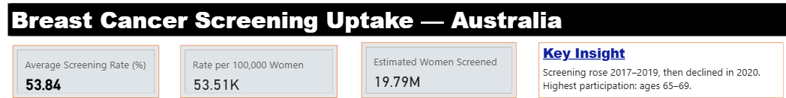
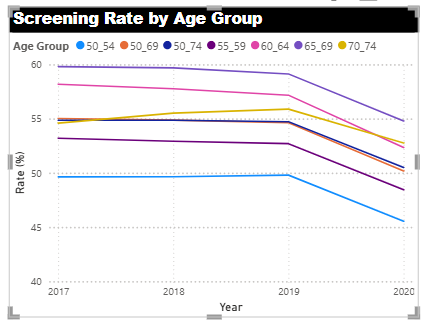
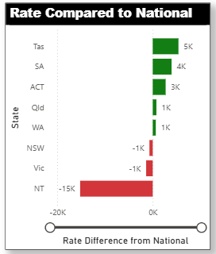
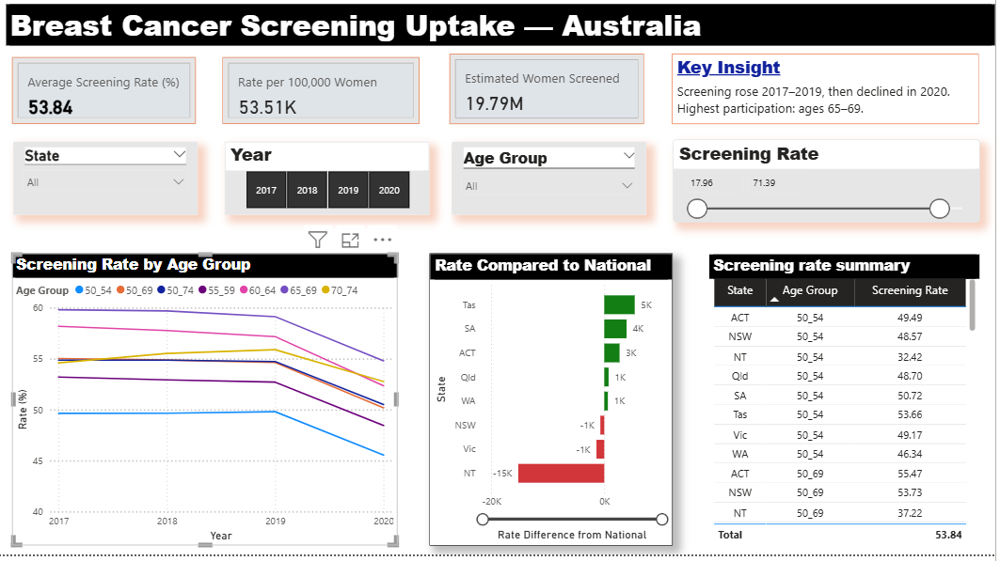

# 📊 Power BI Analytics and Dashboard 
Engagement and Scoping  ·  Power Query · DAX Measures · KPI Cards · Slicers · Formatting · Benchmarking · Dashboard Design · Key Findings

A comprehensive, end-to-end guide to building an interactive Power BI dashboard.

**Live Guide:** http://habtamubizuayehu.com/Power-BI-Analytics-and-Dashboard/  
**Full Guide (HTML):** https://habtamubizuayehu.github.io/Power-BI-Analytics-and-Dashboard/power_BI.html 
**Download Power BI File (.pbix):** https://github.com/HabtamuBizuayehu/Power-BI-Analytics-and-Dashboard/raw/main/Power%20BI%20Dashboard.pbix
**View on GitHub:** https://github.com/HabtamuBizuayehu/Power-BI-Analytics-and-Dashboard/blob/main/power_BI.html  

> The Power BI `.pbix` file can be opened in Power BI Desktop (free) on any 
> computer. All data, measures, and visuals are fully embedded and 
> ready to explore interactively.
---

## 🚀 Overview

This project demonstrates a complete data analytics workflow in Power BI, 
from raw data preparation through to interactive dashboard design and 
evidence synthesis. It is designed as a practical, self-contained 
reference for analysts, data scientists, and students working in Power BI.

The project covers:
- Stakeholder engagement and project scoping
- Data loading and transformation using Power Query M code
- Reshaping data from wide to long format
- DAX measure development for KPI cards and benchmarking
- Interactive slicer design and conditional formatting
- Dashboard layout, theming, and visual communication
- Key findings and evidence synthesis

---

## 🖼️ Dashboard Preview

### KPI Cards and Slicers
Three KPI cards display the average screening rate, rate per 100,000 
women, and estimated women screened, with four interactive slicers 
allowing users to filter by state, year, age group, and screening 
rate range.

### Screening Rate Trend by Age Group
A line chart showing how screening participation changed from 2017 
to 2020 across five age groups, with rates peaking in 2019 before 
declining in 2020.

### Rate Compared to National Average
A horizontal bar chart benchmarking each state against the national 
average, with green bars indicating above-average performance and 
red bars indicating below-average coverage — NT shows the largest gap.

### Final Dashboard Overview
The completed dashboard integrating all KPI cards, slicers, trend 
chart, national benchmarking visual, and summary table into a single 
cohesive, interactive report page.

---

## ⚙️ Requirements

**Software:**

- Power BI Desktop (free — download from [microsoft.com](https://powerbi.microsoft.com/desktop))
- R 4.3+
- Quarto
- RStudio (recommended)
---

## 📊 Key Features

| Topic | Description |
|---|---|
| Power Query | Data loading, reshaping wide to long, year recoding, state filtering |
| DAX Measures | Average rate, rate per 100k, national benchmarking, KPI cards |
| Slicers | State, year, age group, and screening rate range filters |
| Conditional Formatting | Green and red bars based on national average comparison |
| Dashboard Design | Dark header, KPI cards, line chart, bar chart, summary table |
| Key Findings | Trend analysis, geographic variation, priority population groups |

---

## 📚 Data Source

Australian Institute of Health and Welfare (AIHW) — Breast Cancer 
Screening Program data, publicly available at 
[www.aihw.gov.au](https://www.aihw.gov.au)

Data period: 2017 to 2020  
Geography: Statistical Area Level 3 (SA3) across all Australian 
states and territories  
Population: Women aged 50 to 74 years

---

## ✨ Author

Habtamu Bizuayehu  
📍 Perth, Western Australia  
🔗 [habtamubizuayehu.com](https://habtamubizuayehu.com)  
🔗 [GitHub](https://github.com/HabtamuBizuayehu)  
🔗 [ORCID](https://orcid.org/0000-0002-1360-4909)  
🔗 [LinkedIn](https://www.linkedin.com/in/habtamu-bizuayehu-94285980/)

---

## 🔖 Tags

`#PowerBI` `#DAX` `#PowerQuery` `#DataVisualisation` `#HealthAnalytics`  
`#DataAnalytics` `#Quarto` `#ReproducibleResearch` `#PublicHealth`  
`#BreastCancerScreening` `#AIHW` `#DashboardDesign`
